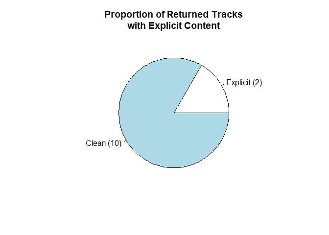

<!-- README.md is generated from README.Rmd. Please edit that file -->

# wrappify

<!-- badges: start -->

[](https://github.com/adityasal/DATA534_Project_G2/actions)
<!-- badges: end -->

Wrappify is an API wrapper for the Spotify API in R. Currently, there is
functionality only for the API functions which do not require access to
an individuals data.

## Installation

You can install the released version of wrappify from
[CRAN](https://CRAN.R-project.org) with:

``` r
install.packages("wrappify")
```

And the development version from [GitHub](https://github.com/) with:

``` r
# install.packages("devtools")
devtools::install_github("adityasal/DATA534_Project_G2")
```

## Example

This is a basic example that shows the intended workflow of wrappify. 

First, we have an artist we wish to know more about. That artist is the
essential alternative metal band “Ghost”. We query getArtistInfo.

``` r
ghost <- getArtistInfo("Ghost", byName = TRUE)
#> Token: Is defined
#> Token Validity: Valid
ghost
#>                    name popularity              genres followers
#> 1            Ghostemane         78           dark trap   1743756
#> 2                 Ghost         69           hard rock   1009697
#> 3       KIDS SEE GHOSTS         67             hip hop    726385
#> 4      Ghostface Killah         66 alternative hip hop    585101
#> 5            Ghostluvme         56             Unknown     10106
#> 6                 GHØST         49             Unknown        40
#> 7  In Love With a Ghost         62  kawaii future bass    234022
#> 8        Ghost and Pals         57             otacore     60009
#> 9     Jukebox The Ghost         59           indie pop    148202
#> 10           GHOST DATA         58       dark clubbing     70956
#>                        id
#> 1  3uL4UpqShC4p2x1dJutoRW
#> 2  1Qp56T7n950O3EGMsSl81D
#> 3  2hPgGN4uhvXAxiXQBIXOmE
#> 4  6FD0unjzGQhX3b6eMccMJe
#> 5  6KtRA9pyDcbDyanI7bfU8W
#> 6  4kDvW6OahLASc5O7aSeIgI
#> 7  21tDFddcOFDYmiobTcls2O
#> 8  3Avni6DLpoxtanND8mG5t8
#> 9  0L8jXe7QeS9oYUoXbANmX4
#> 10 042mLfOBpH8OoX8A6sUYhf
```

We see that Ghost is the second artist in the list. We pull out the
Spotify ID and use it to get Ghost’s top songs.

``` r
id <- ghost[2,]$id

ghostsongs <- getTopSongs(id)
#> Token: Is defined
#> Token Validity: Valid
ghostsongs
#>                  song                     id popularity duration_mins
#> 1       Dance Macabre 1E2WTcYLP1dFe1tiGDwRmT         58      3.662000
#> 2       Square Hammer 2XgTw2co6xv95TmKpMcL70         57      3.988217
#> 3     Mary On A Cross 2HZLXBOnaSRhXStMLrq9fD         57      4.080067
#> 4    Kiss The Go-Goat 56k2ztFw7hQRzDeoe80pJo         55      3.261550
#> 5              Cirice 3ZXZ9RMsznqgyHnyq0K5FL         54      6.034883
#> 6                Rats 4u39IY2QjY1utpNCCF4is0         53      4.359550
#> 7              Ritual 5ZiTzbMB53mIiP3I4uQCmt         50      4.479100
#> 8               He Is 4ExR43GqMe2KwWM3VPGUmO         46      4.219550
#> 9  If You Have Ghosts 1sNSlzvQ5jPir46X5X1TeH         51      3.581333
#> 10          Year Zero 1YBf7Tq9bpcVwvnlP8YbQS         50      5.836433
```

We are interested in knowing more about the song “Dance Macabre”, so we
pull out the song ID and use it to generate a graph of audio features.

``` r
dance <- ghostsongs[1,]$id
getAudioFeatures(dance, output = "graph")
#> Token: Is defined
#> Token Validity: Valid
#> Token: Is defined
#> Token Validity: Valid
```

 We
learn that we really like Ghost, and want to get some similar artists.

``` r
getRelatedArtists(id)
#> Token: Is defined
#> Token Validity: Valid
#>                 name                     id
#> 1           Mastodon 1Dvfqq39HxvCJ3GvfeIFuT
#> 2          Kvelertak 0VE0GTaTSeeGSzrQpLmeb9
#> 3         Candlemass 7zDtfSB0AOZWhpuAHZIOw5
#> 4         Arch Enemy 0DCw6lHkzh9t7f8Hb4Z0Sx
#> 5          Testament 28hJdGN1Awf7u3ifk2lVkg
#> 6       King Diamond 5i0ph60TnwTlIGrOZAmcZa
#> 7             Gojira 0GDGKpJFhVpcjIGF8N6Ewt
#> 8              Opeth 0ybFZ2Ab08V8hueghSXm6E
#> 9           Amorphis 2UOVgpgiNTC6KK0vSC77aD
#> 10   Type O Negative 0blJzvevdXrp21YeI2vbco
#> 11       Amon Amarth 3pulcT2wt7FEG10lQlqDJL
#> 12          Baroness 3KdXhEwbqFHfNfSk7L9E87
#> 13      Dimmu Borgir 6e8ISIsI7UQZPyEorefAhK
#> 14            Avatar 4jpaXieuls7LVzG1uma5Rs
#> 15           Kreator 3BM0EaYmkKWuPmmHFUTQHv
#> 16 Children Of Bodom 1xUhNgw4eJDZfvumIpcz1B
#> 17         In Flames 57ylwQTnFnIhJh4nu4rxCs
#> 18          Behemoth 1MK0sGeyTNkbefYGj673e9
#> 19 Dark Tranquillity 5EHvXKnNz78jkAVgTQLQ5O
#> 20     Paradise Lost 0gIo6kGl4KsCeIbqtZVHYp
```

And now we can choose one of these artists that look interesting and
learn more about them as well.

# LUKA


# ADITYA

Or, if we would prefer to listen to a podcast, we can use wrappify as
well.

Looking for recent episodes from your favorite podcaster but can’t seem
to remember their ID, don’t worry use `getPodcastID` to do just that.

``` r
getPodcastID('conspiracy theory')
#> Token: Is defined
#> Token Validity: Valid
#> [1] "5RdShpOtxKO3ZWohR2M6Sv"
```

``` r
getRecentEpisodes('5RdShpOtxKO3ZWohR2M6Sv', limit=5)
#> Token: Is defined
#> Token Validity: Valid
#>                           Episode Name Release Date Duration Explicit
#> 1                       Peak Oil Pt. 2   2021-02-17       40    FALSE
#> 2                       Peak Oil Pt. 1   2021-02-15       39    FALSE
#> 3   Danny Casolaro & The Octopus Pt. 2   2021-02-10       43    FALSE
#> 4   Danny Casolaro & The Octopus Pt. 1   2021-02-08       46    FALSE
#> 5 New Limited Series: Criminal Couples   2021-02-04        1    FALSE
#>               Episode ID
#> 1 4wZc2l5ZAEhX9wquq1nNrm
#> 2 4nRWJ76Tu0ceXJj3uJc4D7
#> 3 4RZfiKSM5dytiaQw7Q7hXd
#> 4 0SGrl1HSnNGv8w5G8sGLB6
#> 5 4DEjNTTeQcxHgZMl1OhwWi
```

Fancy a shorter episode, use the duration filter and…

``` r
getRecentEpisodes('5RdShpOtxKO3ZWohR2M6Sv', duration = 30, limit=5)
#> Token: Is defined
#> Token Validity: Valid
#>                            Episode Name Release Date Duration Explicit
#> 5  New Limited Series: Criminal Couples   2021-02-04        1    FALSE
#> 11  Welcome to the Family: The Kennedys   2021-01-19        1    FALSE
#> 23              Introducing: Science Vs   2020-11-19       29    FALSE
#> 36               All New! Superstitions   2020-10-13       13    FALSE
#> NA                                 <NA>         <NA>       NA       NA
#>                Episode ID
#> 5  4DEjNTTeQcxHgZMl1OhwWi
#> 11 0X4uXvFA8gfQ7PKzejMmYR
#> 23 1rECoP64UbepFsO8sV3xE0
#> 36 1UcbprjllCLM7yGHpc1TAj
#> NA                   <NA>
```

That should do it.

You could also check out some basic stats. In this release, you can plot
the duration of episodes over time, but don’t worry; we will add more
functionality to this function in the future\! Just enter the podcast ID
and …

``` r
getBasicStats('5RdShpOtxKO3ZWohR2M6Sv')
#> Token: Is defined
#> Token Validity: Valid
```



Craving for more use our `searchForPodcast` to find a new show. How
about a child-friendly Spanish podcast on history? Type in `history`,
change the language to `es` and change `explicit to`FALSE\`.

``` r
searchForPodcast('history', language = 'es', market = 'ES', explicit = FALSE)
#> Token: Is defined
#> Token Validity: Valid
#>                                      Podcast Name          Podcast Publisher
#> 1 Curiosidades de la Historia National Geographic National Geographic España
#> 2            Historia de España para selectividad             Podium Podcast
#> 3                        HISTORIAS DE LA HISTORIA                 VIVA RADIO
#> 4                           Historia con el móvil             Podium Podcast
#> 5                              Historias perdidas               Clío Podcast
#>   Explicit Language             Podcast ID
#> 1    FALSE       es 5LpYg29KE8rckzwEj2JGmS
#> 2    FALSE       es 1ukhoriiZiLoxTNW6ZQTeE
#> 3    FALSE       es 39wGmvob0nYl6L1klXiew9
#> 4    FALSE       es 55iNyxqAXcGiX9S1GlsVPn
#> 5    FALSE       es 2juHTbUW50AdvN1sERHDSG
```

You’ll still need to render `README.Rmd` regularly, to keep `README.md`
up-to-date. `devtools::build_readme()` is handy for this. You could also
use GitHub Actions to re-render `README.Rmd` every time you push. An
example workflow can be found here:
<https://github.com/r-lib/actions/tree/master/examples>.
