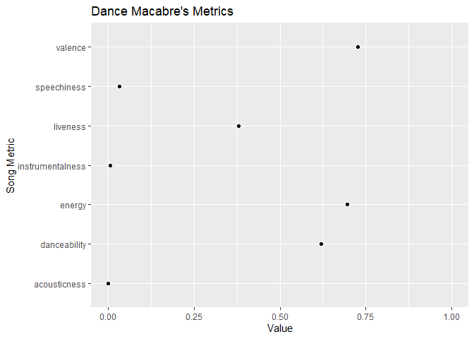
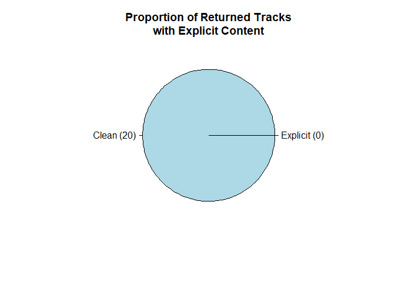

<!-- README.md is generated from README.Rmd. Please edit that file -->

# wrappify

<!-- badges: start -->

[](https://github.com/adityasal/DATA534_Project_G2/actions)
[](https://travis-ci.org/lukavuko/wrappify)
[](https://codecov.io/gh/lukavuko/wrappify)
<!-- badges: end -->

Wrappify is an API wrapper for the Spotify API in R. Currently, there is
functionality only for the API functions which do not require access to
an individuals data.

## Installation

You can install the released version of wrappify from
[CRAN](https://CRAN.R-project.org) with:

``` r
install.packages("wrappify")
```

And the development version from [GitHub](https://github.com/) with:

``` r
# install.packages("devtools")
devtools::install_github("lukavuko/wrappify")
```

## Example 1: Obtaining Song and Artist Information

This is a basic example that shows the intended workflow of wrappify.

First, we have an artist we wish to know more about. That artist is the
essential alternative metal band “Ghost”. We query getArtistInfo.

``` r
ghost <- getArtistInfo("Ghost", byName = TRUE)
ghost
#>                    name popularity              genres followers
#> 1            Ghostemane         78           dark trap   1743756
#> 2                 Ghost         69           hard rock   1009697
#> 3       KIDS SEE GHOSTS         67             hip hop    726385
#> 4      Ghostface Killah         66 alternative hip hop    585101
#> 5            Ghostluvme         56             Unknown     10106
#> 6                 GHØST         49             Unknown        40
#> 7  In Love With a Ghost         62  kawaii future bass    234022
#> 8        Ghost and Pals         57             otacore     60009
#> 9     Jukebox The Ghost         59           indie pop    148202
#> 10           GHOST DATA         58       dark clubbing     70956
#>                        id
#> 1  3uL4UpqShC4p2x1dJutoRW
#> 2  1Qp56T7n950O3EGMsSl81D
#> 3  2hPgGN4uhvXAxiXQBIXOmE
#> 4  6FD0unjzGQhX3b6eMccMJe
#> 5  6KtRA9pyDcbDyanI7bfU8W
#> 6  4kDvW6OahLASc5O7aSeIgI
#> 7  21tDFddcOFDYmiobTcls2O
#> 8  3Avni6DLpoxtanND8mG5t8
#> 9  0L8jXe7QeS9oYUoXbANmX4
#> 10 042mLfOBpH8OoX8A6sUYhf
```

We see that Ghost is the second artist in the list. We pull out the
Spotify ID and use it to get Ghost’s top songs.

``` r
id <- ghost[2,]$id

ghostsongs <- getTopSongs(id)
#> Token: Is defined
#> Token Validity: Valid
ghostsongs
#>                  song                     id popularity duration_mins
#> 1       Dance Macabre 1E2WTcYLP1dFe1tiGDwRmT         58      3.662000
#> 2       Square Hammer 2XgTw2co6xv95TmKpMcL70         57      3.988217
#> 3     Mary On A Cross 2HZLXBOnaSRhXStMLrq9fD         57      4.080067
#> 4    Kiss The Go-Goat 56k2ztFw7hQRzDeoe80pJo         55      3.261550
#> 5              Cirice 3ZXZ9RMsznqgyHnyq0K5FL         54      6.034883
#> 6                Rats 4u39IY2QjY1utpNCCF4is0         53      4.359550
#> 7              Ritual 5ZiTzbMB53mIiP3I4uQCmt         50      4.479100
#> 8               He Is 4ExR43GqMe2KwWM3VPGUmO         46      4.219550
#> 9  If You Have Ghosts 1sNSlzvQ5jPir46X5X1TeH         51      3.581333
#> 10          Year Zero 1YBf7Tq9bpcVwvnlP8YbQS         50      5.836433
```

We are interested in knowing more about the song “Dance Macabre”, so we
pull out the song ID and use it to generate a graph of audio features.

``` r
dance <- ghostsongs[1,]$id
getAudioFeatures(dance, output = "graph")
#> Token: Is defined
#> Token Validity: Valid
#> Token: Is defined
#> Token Validity: Valid
```

 We
learn that we really like Ghost, and want to get some similar artists.

``` r
getRelatedArtists(id)
#> Token: Is defined
#> Token Validity: Valid
#>                 name                     id
#> 1           Mastodon 1Dvfqq39HxvCJ3GvfeIFuT
#> 2          Kvelertak 0VE0GTaTSeeGSzrQpLmeb9
#> 3         Candlemass 7zDtfSB0AOZWhpuAHZIOw5
#> 4         Arch Enemy 0DCw6lHkzh9t7f8Hb4Z0Sx
#> 5          Testament 28hJdGN1Awf7u3ifk2lVkg
#> 6       King Diamond 5i0ph60TnwTlIGrOZAmcZa
#> 7             Gojira 0GDGKpJFhVpcjIGF8N6Ewt
#> 8              Opeth 0ybFZ2Ab08V8hueghSXm6E
#> 9           Amorphis 2UOVgpgiNTC6KK0vSC77aD
#> 10   Type O Negative 0blJzvevdXrp21YeI2vbco
#> 11       Amon Amarth 3pulcT2wt7FEG10lQlqDJL
#> 12          Baroness 3KdXhEwbqFHfNfSk7L9E87
#> 13      Dimmu Borgir 6e8ISIsI7UQZPyEorefAhK
#> 14            Avatar 4jpaXieuls7LVzG1uma5Rs
#> 15           Kreator 3BM0EaYmkKWuPmmHFUTQHv
#> 16 Children Of Bodom 1xUhNgw4eJDZfvumIpcz1B
#> 17         In Flames 57ylwQTnFnIhJh4nu4rxCs
#> 18          Behemoth 1MK0sGeyTNkbefYGj673e9
#> 19 Dark Tranquillity 5EHvXKnNz78jkAVgTQLQ5O
#> 20     Paradise Lost 0gIo6kGl4KsCeIbqtZVHYp
```

And now we can choose one of these artists that look interesting and
learn more about them as well.

## Example 2: Conversion of Artist/Song names to their IDs

Spotify works exclusively through object IDs, but as people of culture
we know our favourite artists, tracks, and podcasts by their names, not
their IDs. As such, we need to be able to convert these names into their
IDs as seamlessly as possible.

Note that artist and track names do not need to be formatted or spelled
correctly to yield valid search results\!

``` r
# One artist, mispelled
getArtistID('sanTanana')
#> Searching artist: sanTanana
#> Token: Is defined
#> Token Validity: Valid
#> Artist Found:  Santana
#>   Artist.name              Artist.ID Artist.Popularity
#> 1     Santana 6GI52t8N5F02MxU0g5U69P                74
#>                                                 Genres
#> 1 blues rock, classic rock, mexican classic rock, rock


# Multiple artists, seamlessly
artists_of_interest <- c('alt j', 'vulfpeck', 'herbie hancock0')

do.call(rbind, lapply(artists_of_interest, getArtistID))
#> Searching artist: alt j
#> Token: Is defined
#> Token Validity: Valid
#> Artist Found:  alt-J
#> Searching artist: vulfpeck
#> Token: Is defined
#> Token Validity: Valid
#> Artist Found:  Vulfpeck
#> Searching artist: herbie hancock0
#> Token: Is defined
#> Token Validity: Valid
#> Artist Found:  Herbie Hancock
#>      Artist.name              Artist.ID Artist.Popularity
#> 1          alt-J 3XHO7cRUPCLOr6jwp8vsx5                75
#> 2       Vulfpeck 7pXu47GoqSYRajmBCjxdD6                66
#> 3 Herbie Hancock 2ZvrvbQNrHKwjT7qfGFFUW                63
#>                                                                                                                        Genres
#> 1                                                                                                     indie rock, modern rock
#> 2                                                                               ann arbor indie, funk rock, instrumental funk
#> 3 bebop, contemporary post-bop, cool jazz, funk, instrumental funk, jazz, jazz funk, jazz fusion, jazz piano, soul, soul jazz
```

When searching for tracks you can also include artist names to narrow
down what track you’re looking for\!

``` r
# Song limit defaults to 5
getTrackID('Love')
#> Searching track: Love
#> Token: Is defined
#> Token Validity: Valid
#>                         Track.Name          Track.Artist               Track.ID
#> 1                                                                              
#> 2    Love Story (Taylor’s Version)          Taylor Swift 3CeCwYWvdfXbZLXFhBrbnf
#> 3             lovely (with Khalid) Billie Eilish, Khalid 0u2P5u6lvoDfwTYjAADbn4
#> 4          What You Know Bout Love             Pop Smoke 1tkg4EHVoqnhR6iFEXb60y
#> 5 Love Galore (feat. Travis Scott)     SZA, Travis Scott 0q75NwOoFiARAVp4EXU4Bs
#> 6                      WITHOUT YOU         The Kid LAROI 27OeeYzk6klgBh83TSvGMA
#>   Track.Popularity
#> 1                 
#> 2               85
#> 3               87
#> 4               91
#> 5               79
#> 6               93

# User can increase limits
getTrackID('Love', limit = 10)
#> Searching track: Love
#> Token: Is defined
#> Token Validity: Valid
#>                          Track.Name           Track.Artist
#> 1                                                         
#> 2     Love Story (Taylor’s Version)           Taylor Swift
#> 3              lovely (with Khalid)  Billie Eilish, Khalid
#> 4           What You Know Bout Love              Pop Smoke
#> 5  Love Galore (feat. Travis Scott)      SZA, Travis Scott
#> 6                       WITHOUT YOU          The Kid LAROI
#> 7                     love language          Ariana Grande
#> 8                 Someone You Loved          Lewis Capaldi
#> 9                         Love Sosa             Chief Keef
#> 10                    Electric Love                  BØRNS
#> 11              LOVE. FEAT. ZACARI. Kendrick Lamar, Zacari
#>                  Track.ID Track.Popularity
#> 1                                         
#> 2  3CeCwYWvdfXbZLXFhBrbnf               85
#> 3  0u2P5u6lvoDfwTYjAADbn4               87
#> 4  1tkg4EHVoqnhR6iFEXb60y               91
#> 5  0q75NwOoFiARAVp4EXU4Bs               79
#> 6  27OeeYzk6klgBh83TSvGMA               93
#> 7  3HwtjYXnBkhsD2gBwyiIHR                0
#> 8  7qEHsqek33rTcFNT9PFqLf               89
#> 9  4IowQDUOzUvNtp72HMDcKO               74
#> 10 2GiJYvgVaD2HtM8GqD9EgQ               84
#> 11 6PGoSes0D9eUDeeAafB2As               77

# User can search with artist name in the string for more precise results
getTrackID('Love whitney houston')
#> Searching track: Love whitney houston
#> Token: Is defined
#> Token Validity: Valid
#>                                   Track.Name          Track.Artist
#> 1                                                                 
#> 2                                Higher Love Kygo, Whitney Houston
#> 3 I Wanna Dance with Somebody (Who Loves Me)       Whitney Houston
#> 4                     Love Will Save the Day       Whitney Houston
#> 5                                Higher Love Kygo, Whitney Houston
#> 6                     I Will Always Love You       Whitney Houston
#>                 Track.ID Track.Popularity
#> 1                                        
#> 2 6oJ6le65B3SEqPwMRNXWjY               80
#> 3 2tUBqZG2AbRi7Q0BIrVrEj               81
#> 4 4gDBc1RxPAvinJrZzZ9nYX               42
#> 5 1kKYjjfNYxE0YYgLa7vgVY               67
#> 6 4eHbdreAnSOrDDsFfc4Fpm               76
```

## Example 3: Exploring New Tracks

We may also be interested in searching for new music based on certain
song metrics (danceability, energy, valence, etc.), artist styles, genre
tags, and even songs themselves. For this we have the
`getTrackRecommendations()` function.

Artist to ID conversion is built into the `getTrackRecommendations`
function so we can directly type names into the function.

Track to ID conversion is not yet implemented so we will use track seeds
from earlier to find new song recommendations. There seem to be some
issues with track seeds as vectors so we’ll use only single tracks as
our seed.

Genres can be types as a vector if wanting multiple genres. Most genre
tags you can think of exist in the Spotify API search, but in case
there’s no return try using other genre names.

``` r
# I want more songs like 'Higher Love' by Kygo and Whitney Houston
getTrackRecommendations(seed_artists = c('kygo', 'whitney houston'),
                        seed_genres = c('tropical house', 'edm'),
                        seed_tracks = '6oJ6le65B3SEqPwMRNXWjY')
#> Searching artist: kygo
#> Token: Is defined
#> Token Validity: Valid
#> Artist Found:  Kygo
#> Searching artist: whitney houston
#> Token: Is defined
#> Token Validity: Valid
#> Artist Found:  Whitney Houston
#> Token: Is defined
#> Token Validity: Valid
```



    #> [[1]]
    #>                                                                     Track.Name
    #> 1                                                                             
    #> 2                                                                         Girl
    #> 3                                               Bigfoot - Dillon Francis Remix
    #> 4                                                             Peaceblaster '08
    #> 5                                                         My Name Is Not Susan
    #> 6                                                                 Never Change
    #> 7                           Where Them Girls At (feat. Nicki Minaj & Flo Rida)
    #> 8                                                              Across the Pond
    #> 9                                                What's Love Got to Do with It
    #> 10                                                                     Ride It
    #> 11                                                               Call You Mine
    #> 12                                                              September Song
    #> 13                                                         Scared to Be Lonely
    #> 14                                                              Together Again
    #> 15                                         Stranger Things (feat. OneRepublic)
    #> 16                                                                 Think Twice
    #> 17                                       Ain't Thinkin Bout You (feat. Louisa)
    #> 18                                                   Everyday - (Netsky Remix)
    #> 19                                                               I'll Be There
    #> 20 Dancing In The Moonlight (feat. NEIMY) - PBH & Jack Sunset Remix Radio Edit
    #> 21                                                               I'll Be There
    #>                    Track.Artist               Track.ID Track.Popularity
    #> 1                                                                      
    #> 2               Destiny's Child 3s2MyU2YCwNNwcSokt0jXD               63
    #> 3                           W&W 4SQfQuxYQx8DJQB88sQmVT               25
    #> 4                          STS9 5ctnrRh81WicuT6prsCHYc                0
    #> 5               Whitney Houston 7623p8KZ24WTeO0NeIb4tV               44
    #> 6                    Don Diablo 1SG6r7daFfpzPcU15luVqB               65
    #> 7                  David Guetta 7ks6AZmFcm3Y6PGGxGSmlB               71
    #> 8                        Ianick 5dKjrBLRbu2knbRC3K4OG5                0
    #> 9             Kygo, Tina Turner 3Be7CLdHZpyzsVijme39cW               77
    #> 10                       Regard 2tnVG71enUj33Ic2nFN6kZ               85
    #> 11 The Chainsmokers, Bebe Rexha 2oejEp50ZzPuQTQ6v54Evp               77
    #> 12                    JP Cooper 0zbzrhfVS9S2TszW3wLQZ7               71
    #> 13      Martin Garrix, Dua Lipa 3ebXMykcMXOcLeJ9xZ17XH               78
    #> 14                Janet Jackson 1GrikfH0jDejDvrxo84n4P               67
    #> 15            Kygo, OneRepublic 4sJqSKPc5fZ5OZ8JiVI44N               61
    #> 16                  Céline Dion 5T0VoskNbpJIqm2RSPU2Xt               59
    #> 17   KREAM, Eden Prince, Louisa 1tjxQYoB2OS2fRZS43ODLQ               54
    #> 18                        Rusko 4JJb5x4qGaKXYaxCahGbEq                0
    #> 19                 Mariah Carey 5rp1lVuLQKe13KTXbmGxE1               56
    #> 20     Jubël, NEIMY, PBH & JACK 2E82VLSCocIcymHDHoMHyr               50
    #> 21                  Jess Glynne 083Qf6hn6sFL6xiOHlZUyn               67
    #>    Explicit.Status                                            Track.Link
    #> 1                                                                       
    #> 2            FALSE https://open.spotify.com/track/3s2MyU2YCwNNwcSokt0jXD
    #> 3            FALSE https://open.spotify.com/track/4SQfQuxYQx8DJQB88sQmVT
    #> 4            FALSE https://open.spotify.com/track/5ctnrRh81WicuT6prsCHYc
    #> 5            FALSE https://open.spotify.com/track/7623p8KZ24WTeO0NeIb4tV
    #> 6            FALSE https://open.spotify.com/track/1SG6r7daFfpzPcU15luVqB
    #> 7             TRUE https://open.spotify.com/track/7ks6AZmFcm3Y6PGGxGSmlB
    #> 8            FALSE https://open.spotify.com/track/5dKjrBLRbu2knbRC3K4OG5
    #> 9            FALSE https://open.spotify.com/track/3Be7CLdHZpyzsVijme39cW
    #> 10           FALSE https://open.spotify.com/track/2tnVG71enUj33Ic2nFN6kZ
    #> 11           FALSE https://open.spotify.com/track/2oejEp50ZzPuQTQ6v54Evp
    #> 12           FALSE https://open.spotify.com/track/0zbzrhfVS9S2TszW3wLQZ7
    #> 13           FALSE https://open.spotify.com/track/3ebXMykcMXOcLeJ9xZ17XH
    #> 14           FALSE https://open.spotify.com/track/1GrikfH0jDejDvrxo84n4P
    #> 15           FALSE https://open.spotify.com/track/4sJqSKPc5fZ5OZ8JiVI44N
    #> 16           FALSE https://open.spotify.com/track/5T0VoskNbpJIqm2RSPU2Xt
    #> 17            TRUE https://open.spotify.com/track/1tjxQYoB2OS2fRZS43ODLQ
    #> 18           FALSE https://open.spotify.com/track/4JJb5x4qGaKXYaxCahGbEq
    #> 19           FALSE https://open.spotify.com/track/5rp1lVuLQKe13KTXbmGxE1
    #> 20           FALSE https://open.spotify.com/track/2E82VLSCocIcymHDHoMHyr
    #> 21           FALSE https://open.spotify.com/track/083Qf6hn6sFL6xiOHlZUyn
    #> 
    #> [[2]]
    #> NULL

Say we aren’t satisfied with our list. We can use other parameters to
better guide Spotify’s recommendation API like so:

``` r
getTrackRecommendations(seed_artists = c('kygo', 'whitney houston'),
                        seed_genres = c('tropical house', 'edm'),
                        seed_tracks = '6oJ6le65B3SEqPwMRNXWjY',
                        limit = 12,
                        market = 'US',
                        min_popularity = 70,
                        target_valence = 1)
#> Searching artist: kygo
#> Token: Is defined
#> Token Validity: Valid
#> Artist Found:  Kygo
#> Searching artist: whitney houston
#> Token: Is defined
#> Token Validity: Valid
#> Artist Found:  Whitney Houston
#> Token: Is defined
#> Token Validity: Valid
```


    #> [[1]]
    #>                                                Track.Name
    #> 1                                                        
    #> 2                              Tick Tock (feat. 24kGoldn)
    #> 3                                           Family Affair
    #> 4                              Feel So Close - Radio Edit
    #> 5                                     Running Back To You
    #> 6                                                  Nobody
    #> 7                                               Instagram
    #> 8                                                  Sucker
    #> 9                            God Is A Dancer (with Mabel)
    #> 10                     This Will Be (An Everlasting Love)
    #> 11 Feels (feat. Pharrell Williams, Katy Perry & Big Sean)
    #> 12                                              Lush Life
    #> 13                                                Ride It
    #>                                                                                                 Track.Artist
    #> 1                                                                                                           
    #> 2                                                                              Clean Bandit, Mabel, 24kGoldn
    #> 3                                                                                              Mary J. Blige
    #> 4                                                                                              Calvin Harris
    #> 5                                                                    Martin Jensen, Alle Farben, Nico Santos
    #> 6                                                                                              NOTD, Catello
    #> 7  Dimitri Vegas & Like Mike, David Guetta, Daddy Yankee, Afro Bros, Natti Natasha, Dimitri Vegas, Like Mike
    #> 8                                                                                             Jonas Brothers
    #> 9                                                                                              Tiësto, Mabel
    #> 10                                                                                              Natalie Cole
    #> 11                                          Calvin Harris, Pharrell Williams, Katy Perry, Big Sean, Funk Wav
    #> 12                                                                                              Zara Larsson
    #> 13                                                                                                    Regard
    #>                  Track.ID Track.Popularity Explicit.Status
    #> 1                                                         
    #> 2  27u7t9d7ZQoyjsCROHuZJ3               82           FALSE
    #> 3  3aw9iWUQ3VrPQltgwvN9Xu               70           FALSE
    #> 4  1gihuPhrLraKYrJMAEONyc               79           FALSE
    #> 5  7feeLzB9KdKJ2ha3OvJ0SZ               70           FALSE
    #> 6  7GiozRoMk95aFl1WbrDdjX               72           FALSE
    #> 7  0U6bQIAh6MCGo1xjbIIx2S               72            TRUE
    #> 8  22vgEDb5hykfaTwLuskFGD               81           FALSE
    #> 9  6fenHIxXuuzKB55wY4WCHP               71           FALSE
    #> 10 0PDCewmZCp0P5s00bptcdd               71           FALSE
    #> 11 5bcTCxgc7xVfSaMV3RuVke               73            TRUE
    #> 12 1rIKgCH4H52lrvDcz50hS8               75           FALSE
    #> 13 2tnVG71enUj33Ic2nFN6kZ               85           FALSE
    #>                                               Track.Link
    #> 1                                                       
    #> 2  https://open.spotify.com/track/27u7t9d7ZQoyjsCROHuZJ3
    #> 3  https://open.spotify.com/track/3aw9iWUQ3VrPQltgwvN9Xu
    #> 4  https://open.spotify.com/track/1gihuPhrLraKYrJMAEONyc
    #> 5  https://open.spotify.com/track/7feeLzB9KdKJ2ha3OvJ0SZ
    #> 6  https://open.spotify.com/track/7GiozRoMk95aFl1WbrDdjX
    #> 7  https://open.spotify.com/track/0U6bQIAh6MCGo1xjbIIx2S
    #> 8  https://open.spotify.com/track/22vgEDb5hykfaTwLuskFGD
    #> 9  https://open.spotify.com/track/6fenHIxXuuzKB55wY4WCHP
    #> 10 https://open.spotify.com/track/0PDCewmZCp0P5s00bptcdd
    #> 11 https://open.spotify.com/track/5bcTCxgc7xVfSaMV3RuVke
    #> 12 https://open.spotify.com/track/1rIKgCH4H52lrvDcz50hS8
    #> 13 https://open.spotify.com/track/2tnVG71enUj33Ic2nFN6kZ
    #> 
    #> [[2]]
    #> NULL

For user interest, a pie chart is provided to view what proportion of
returned content is explicit. In the future we would like to integrate
optional plot parameters, and other optional plots that can highlight
song popularity and general genre music metrics such as their energy,
acousticness, liveness, and so forth.

``` r
getTrackRecommendations(seed_artists = c('kygo', 'whitney houston'),
                        seed_genres = c('tropical house', 'edm'),
                        seed_tracks = '6oJ6le65B3SEqPwMRNXWjY',
                        limit = 12,
                        market = 'US',
                        target_energy = 0.8,
                        target_danceability = 1,
                        target_valence = 1)
#> Searching artist: kygo
#> Token: Is defined
#> Token Validity: Valid
#> Artist Found:  Kygo
#> Searching artist: whitney houston
#> Token: Is defined
#> Token Validity: Valid
#> Artist Found:  Whitney Houston
#> Token: Is defined
#> Token Validity: Valid
```


    #> [[1]]
    #>                                                Track.Name
    #> 1                                                        
    #> 2                                              Like Sugar
    #> 3          When the Going Gets Tough, The Tough Get Going
    #> 4  Feels (feat. Pharrell Williams, Katy Perry & Big Sean)
    #> 5                                           Family Affair
    #> 6                                                  Nobody
    #> 7                                     Jump (Original Mix)
    #> 8                                                Emotions
    #> 9                                                  Sucker
    #> 10                                                Ride It
    #> 11                                      Every Little Step
    #> 12                                          Keep You Mine
    #> 13                                              Your Song
    #>                                                        Track.Artist
    #> 1                                                                  
    #> 2                                                        Chaka Khan
    #> 3                                                       Billy Ocean
    #> 4  Calvin Harris, Pharrell Williams, Katy Perry, Big Sean, Funk Wav
    #> 5                                                     Mary J. Blige
    #> 6                                                     NOTD, Catello
    #> 7                                               The Pointer Sisters
    #> 8                                                      Mariah Carey
    #> 9                                                    Jonas Brothers
    #> 10                                                           Regard
    #> 11                                                      Bobby Brown
    #> 12                                                 NOTD, SHY Martin
    #> 13                                                         Rita Ora
    #>                  Track.ID Track.Popularity Explicit.Status
    #> 1                                                         
    #> 2  0lWEatZXBBYUzEQX5aMeSj               58           FALSE
    #> 3  5UU5FbITNm5OunvHQdsKME               63           FALSE
    #> 4  5bcTCxgc7xVfSaMV3RuVke               73            TRUE
    #> 5  3aw9iWUQ3VrPQltgwvN9Xu               70           FALSE
    #> 6  7GiozRoMk95aFl1WbrDdjX               72           FALSE
    #> 7  1kIu9zpYtWjgrLlsactlna               64           FALSE
    #> 8  0cELvuwJW1acISUHYB6suj               62           FALSE
    #> 9  22vgEDb5hykfaTwLuskFGD               81           FALSE
    #> 10 2tnVG71enUj33Ic2nFN6kZ               85           FALSE
    #> 11 0s6e7ZafqOAUBDoQYGmxrc               55           FALSE
    #> 12 0OJN2A3Qyvd7pwSF0AIteC               67           FALSE
    #> 13 4c2W3VKsOFoIg2SFaO6DY5               66           FALSE
    #>                                               Track.Link
    #> 1                                                       
    #> 2  https://open.spotify.com/track/0lWEatZXBBYUzEQX5aMeSj
    #> 3  https://open.spotify.com/track/5UU5FbITNm5OunvHQdsKME
    #> 4  https://open.spotify.com/track/5bcTCxgc7xVfSaMV3RuVke
    #> 5  https://open.spotify.com/track/3aw9iWUQ3VrPQltgwvN9Xu
    #> 6  https://open.spotify.com/track/7GiozRoMk95aFl1WbrDdjX
    #> 7  https://open.spotify.com/track/1kIu9zpYtWjgrLlsactlna
    #> 8  https://open.spotify.com/track/0cELvuwJW1acISUHYB6suj
    #> 9  https://open.spotify.com/track/22vgEDb5hykfaTwLuskFGD
    #> 10 https://open.spotify.com/track/2tnVG71enUj33Ic2nFN6kZ
    #> 11 https://open.spotify.com/track/0s6e7ZafqOAUBDoQYGmxrc
    #> 12 https://open.spotify.com/track/0OJN2A3Qyvd7pwSF0AIteC
    #> 13 https://open.spotify.com/track/4c2W3VKsOFoIg2SFaO6DY5
    #> 
    #> [[2]]
    #> NULL

# ADITYA

Or, if we would prefer to listen to a podcast, we can use wrappify as
well.

Looking for recent episodes from your favorite podcaster but can’t seem
to remember their ID, don’t worry use `getPodcastID` to do just that.

``` r
getPodcastID('conspiracy theory')
#> Token: Is defined
#> Token Validity: Valid
#> [1] "5RdShpOtxKO3ZWohR2M6Sv"
```

``` r
getRecentEpisodes('5RdShpOtxKO3ZWohR2M6Sv', limit=5)
#> Token: Is defined
#> Token Validity: Valid
#>                           Episode Name Release Date Duration Explicit
#> 1                       Peak Oil Pt. 2   2021-02-17       40    FALSE
#> 2                       Peak Oil Pt. 1   2021-02-15       39    FALSE
#> 3   Danny Casolaro & The Octopus Pt. 2   2021-02-10       43    FALSE
#> 4   Danny Casolaro & The Octopus Pt. 1   2021-02-08       46    FALSE
#> 5 New Limited Series: Criminal Couples   2021-02-04        1    FALSE
#>               Episode ID
#> 1 4wZc2l5ZAEhX9wquq1nNrm
#> 2 4nRWJ76Tu0ceXJj3uJc4D7
#> 3 4RZfiKSM5dytiaQw7Q7hXd
#> 4 0SGrl1HSnNGv8w5G8sGLB6
#> 5 4DEjNTTeQcxHgZMl1OhwWi
```

Fancy a shorter episode, use the duration filter and…

``` r
getRecentEpisodes('5RdShpOtxKO3ZWohR2M6Sv', duration = 30, limit=5)
#> Token: Is defined
#> Token Validity: Valid
#>                            Episode Name Release Date Duration Explicit
#> 5  New Limited Series: Criminal Couples   2021-02-04        1    FALSE
#> 11  Welcome to the Family: The Kennedys   2021-01-19        1    FALSE
#> 23              Introducing: Science Vs   2020-11-19       29    FALSE
#> 36               All New! Superstitions   2020-10-13       13    FALSE
#> NA                                 <NA>         <NA>       NA       NA
#>                Episode ID
#> 5  4DEjNTTeQcxHgZMl1OhwWi
#> 11 0X4uXvFA8gfQ7PKzejMmYR
#> 23 1rECoP64UbepFsO8sV3xE0
#> 36 1UcbprjllCLM7yGHpc1TAj
#> NA                   <NA>
```

That should do it.

You could also check out some basic stats. In this release, you can plot
the duration of episodes over time, but don’t worry; we will add more
functionality to this function in the future\! Just enter the podcast ID
and …

``` r
getBasicStats('5RdShpOtxKO3ZWohR2M6Sv')
#> Token: Is defined
#> Token Validity: Valid
```


Craving for more use our `searchForPodcast` to find a new show. How
about a child-friendly Spanish podcast on history? Type in `history`,
change the language to `es` and change `explicit to`FALSE\`.

``` r
searchForPodcast('history', language = 'es', market = 'ES', explicit = FALSE)
#> Token: Is defined
#> Token Validity: Valid
#>                                      Podcast Name          Podcast Publisher
#> 1 Curiosidades de la Historia National Geographic National Geographic España
#> 2            Historia de España para selectividad             Podium Podcast
#> 3                        HISTORIAS DE LA HISTORIA                 VIVA RADIO
#> 4                           Historia con el móvil             Podium Podcast
#> 5                              Historias perdidas               Clío Podcast
#>   Explicit Language             Podcast ID
#> 1    FALSE       es 5LpYg29KE8rckzwEj2JGmS
#> 2    FALSE       es 1ukhoriiZiLoxTNW6ZQTeE
#> 3    FALSE       es 39wGmvob0nYl6L1klXiew9
#> 4    FALSE       es 55iNyxqAXcGiX9S1GlsVPn
#> 5    FALSE       es 2juHTbUW50AdvN1sERHDSG
```

You’ll still need to render `README.Rmd` regularly, to keep `README.md`
up-to-date. `devtools::build_readme()` is handy for this. You could also
use GitHub Actions to re-render `README.Rmd` every time you push. An
example workflow can be found here:
<https://github.com/r-lib/actions/tree/master/examples>.
